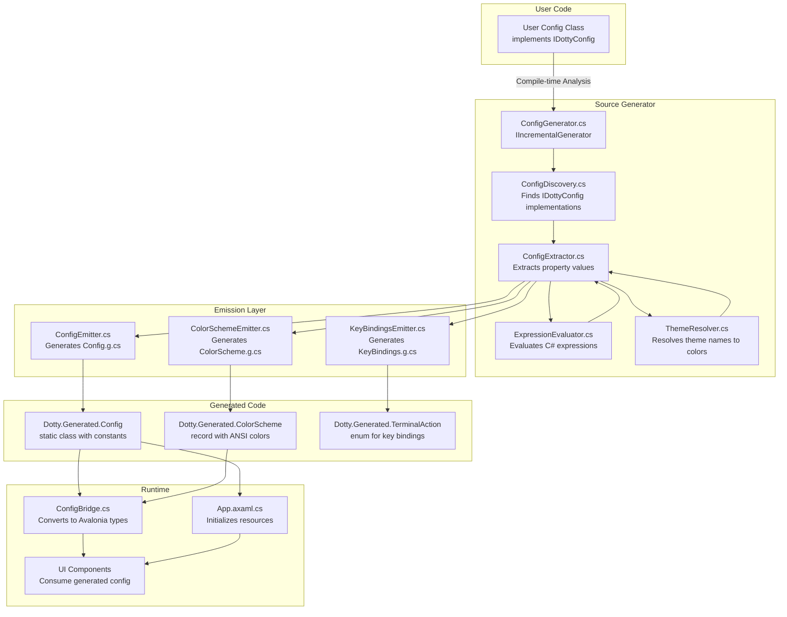
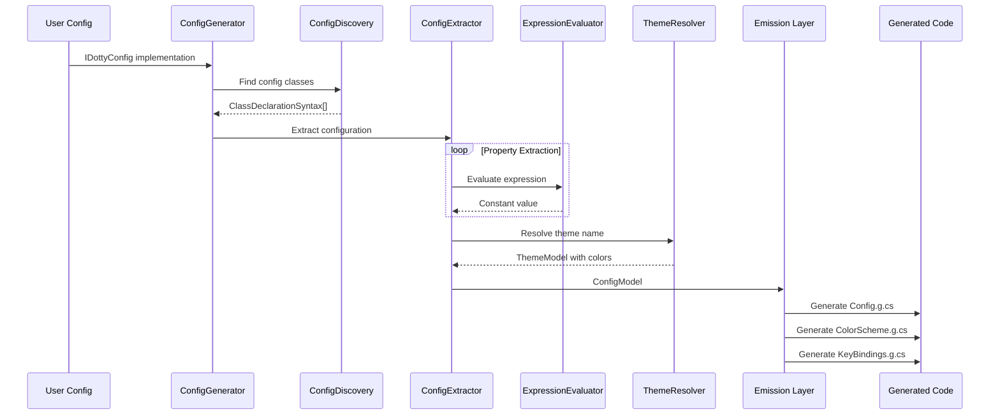
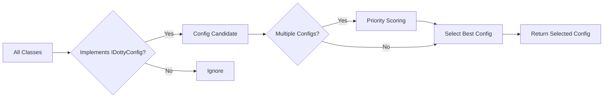
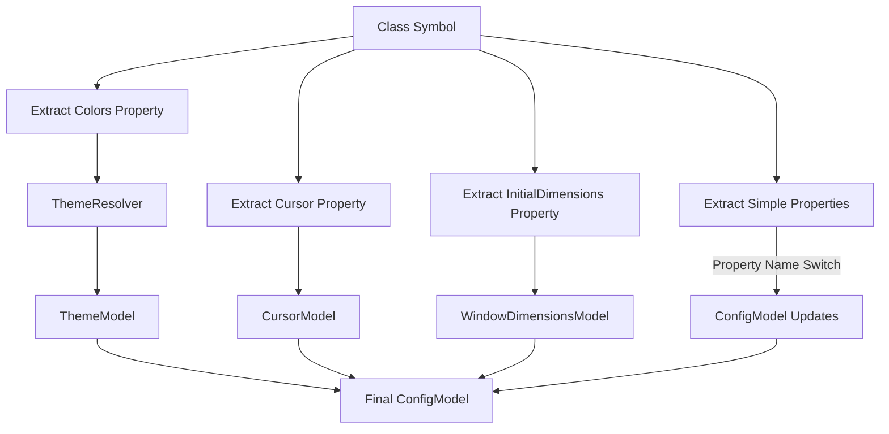
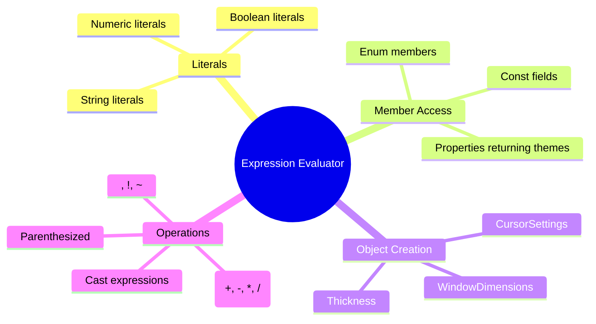
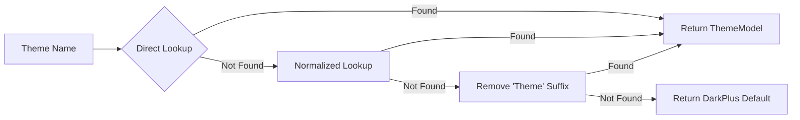
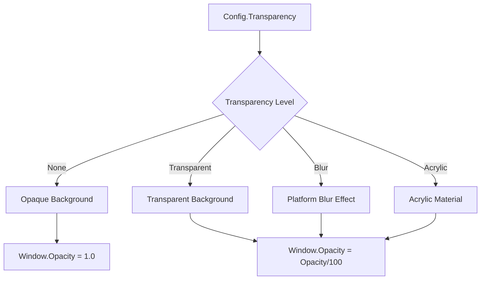
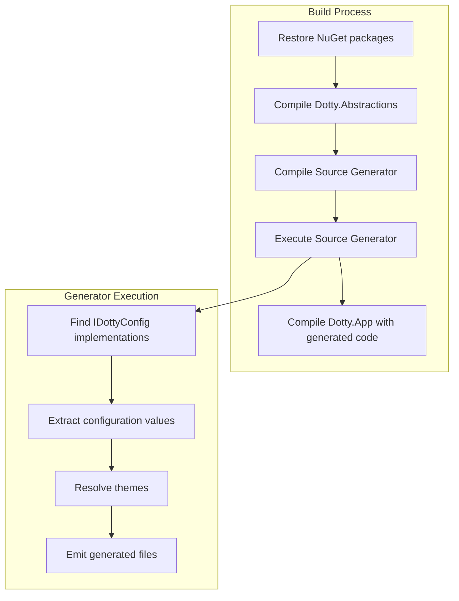

# Dotty Config Source Code Generator Architecture

## Table of Contents

1. [Executive Summary](#executive-summary)
2. [Architecture Overview](#architecture-overview)
3. [Core Components](#core-components)
4. [Avalonia Integration](#avalonia-integration)
5. [Build System Integration](#build-system-integration)
6. [User Customization](#user-customization)
7. [Testing Strategy](#testing-strategy)
8. [Strengths & Trade-offs](#strengths--trade-offs)

---

## Executive Summary

The **Dotty Config Source Code Generator** is a compile-time code generation system that transforms user configuration classes implementing `IDottyConfig` into optimized, strongly-typed, static configuration classes. This system bridges the gap between user-friendly configuration interfaces and high-performance, AOT-compatible runtime code.

### What It Does

- **Scans** the compilation for classes implementing `IDottyConfig`
- **Extracts** configuration values from properties and expressions
- **Resolves** theme references to full color palettes
- **Generates** three source files at compile time:
  - `Dotty.Generated.Config.g.cs` - Main configuration constants
  - `Dotty.Generated.ColorScheme.g.cs` - ANSI color palette
  - `Dotty.Generated.KeyBindings.g.cs` - Terminal action enum

### Why It Exists

Traditional configuration approaches (JSON files, runtime reflection, configuration binding) have significant drawbacks for a terminal emulator:

| Approach | Startup Time | AOT Compatibility | Type Safety | IntelliSense |
|----------|-------------|-------------------|-------------|--------------|
| JSON + Reflection | Slow | ❌ Poor | ❌ Runtime errors | ❌ None |
| Manual Static Classes | Fast | ✅ Excellent | ✅ Compile-time | ✅ Full |
| **Source Generator** | **Fast** | **✅ Excellent** | **✅ Compile-time** | **✅ Full** |

The source generator approach provides:
- **Zero runtime reflection** - All values resolved at compile time
- **Native AOT compatibility** - No dynamic code generation
- **Compile-time validation** - Configuration errors caught during build
- **IDE integration** - Full IntelliSense and Go To Definition support

---

## Architecture Overview

### High-Level Data Flow



### Component Interaction Diagram



---

## Core Components

### 1. Source Generator Entry Point (ConfigGenerator.cs)

**Location:** `src/Dotty.Config.SourceGenerator/ConfigGenerator.cs`

The `ConfigGenerator` is the entry point implementing `IIncrementalGenerator`. It uses the incremental source generator API for optimal performance.

```csharp
[Generator(LanguageNames.CSharp)]
public class ConfigGenerator : IIncrementalGenerator
{
    public void Initialize(IncrementalGeneratorInitializationContext context)
    {
        // Register syntax provider to find IDottyConfig implementations
        var configClasses = context.SyntaxProvider
            .CreateSyntaxProvider(
                predicate: static (node, _) => node is ClassDeclarationSyntax c && c.BaseList != null,
                transform: (ctx, _) => GetConfigClass(ctx))
            .Where(c => c is not null)
            .Collect();
        
        // Combine with compilation and register output
        var compilationAndConfigs = context.CompilationProvider.Combine(configClasses);
        context.RegisterSourceOutput(compilationAndConfigs, Execute);
    }
}
```

**Key Design Decisions:**
- **Incremental API**: Only re-runs when config classes change
- **Syntax filtering**: Early predicate filters non-class nodes
- **Semantic model**: Full symbol resolution for accurate type checking

**Generated Outputs:**

| File | Description |
|------|-------------|
| `Dotty.Generated.Config.g.cs` | Static class with configuration constants |
| `Dotty.Generated.ColorScheme.g.cs` | Record struct with ANSI color palette |
| `Dotty.Generated.KeyBindings.g.cs` | TerminalAction enum |

---

### 2. Discovery Pipeline (ConfigDiscovery.cs)

**Location:** `src/Dotty.Config.SourceGenerator/Pipeline/ConfigDiscovery.cs`

Responsible for finding and selecting the best `IDottyConfig` implementation from multiple candidates.



**Priority Scoring System:**

```csharp
private static int GetPriorityScore(ClassDeclarationSyntax classDecl)
{
    var name = classDecl.Identifier.ValueText;
    
    // Default configs have lowest priority (100)
    if (name == "DefaultConfig" || name == "DefaultDottyConfig")
        return 100;
    
    // User configs have highest priority (0)
    if (name.Contains("Config"))
        return 0;
    
    return 50; // Medium priority for others
}
```

This priority system allows users to override default configurations simply by creating their own config class with a non-default name.

---

### 3. Extraction Pipeline

#### 3a. ConfigExtractor.cs

**Location:** `src/Dotty.Config.SourceGenerator/Pipeline/ConfigExtractor.cs`

The extraction pipeline transforms C# syntax trees into a `ConfigModel` with strongly-typed values.

**Extraction Flow:**



**Property Name Mapping:**

| Property Name | Evaluated Type | ConfigModel Property |
|---------------|----------------|---------------------|
| `FontFamily` | `string` | `FontFamily` |
| `FontSize` | `double` or `int` | `FontSize` |
| `CellPadding` | `double` or `int` | `CellPadding` |
| `ContentPadding` | `ThicknessModel` | `ContentPadding` |
| `ScrollbackLines` | `int` | `ScrollbackLines` |
| `SelectionColor` | `uint` | `SelectionColor` |
| `TabBarBackgroundColor` | `uint` | `TabBarBackgroundColor` |
| `InactiveTabDestroyDelayMs` | `int` | `InactiveTabDestroyDelayMs` |
| `WindowOpacity` | `int` (0-100) | `WindowOpacity` (byte) |
| `Transparency` | `string` | `Transparency` |

#### 3b. ExpressionEvaluator.cs

**Location:** `src/Dotty.Config.SourceGenerator/Pipeline/ExpressionEvaluator.cs`

Evaluates C# expression syntax to extract compile-time constant values.

**Supported Expression Types:**



**Evaluation Example:**

```csharp
// Input expression from user config
public Thickness? ContentPadding => new Thickness(10, 5);

// Evaluation process
ObjectCreationExpressionSyntax
  ├── Type: Thickness
  ├── Arguments: [10, 5]
  │     ├── Evaluate(10) → 10 (int → double)
  │     └── Evaluate(5) → 5 (int → double)
  └── Result: ThicknessModel(10.0, 5.0, 10.0, 5.0)
```

---

### 4. Theme Resolution (ThemeResolver.cs)

**Location:** `src/Dotty.Config.SourceGenerator/Pipeline/ThemeResolver.cs`

Resolves theme names (e.g., `DarkPlus`, `CatppuccinMocha`) to complete `ThemeModel` instances with full ANSI color palettes.



**Theme Loading Strategy:**

1. **Embedded JSON** (`themes.json`): Primary theme database with aliases
2. **Fallback themes**: Hardcoded DarkPlus, CatppuccinMocha, Dracula if JSON fails
3. **Name normalization**: Handles variations like `dark-plus` → `DarkPlus`

**Theme Resolution Features:**

```csharp
// Supports multiple naming conventions
ThemeResolver.Resolve("DarkPlus");        // Direct
ThemeResolver.Resolve("darkplus");        // Case-insensitive
ThemeResolver.Resolve("dark-plus");       // Normalized
ThemeResolver.Resolve("DarkPlusTheme");   // With suffix
```

---

### 5. Emission Layer

The emission layer converts `ConfigModel` into C# source code using `StringBuilder` for efficiency.

#### 5a. ConfigEmitter.cs

Generates the main `Config` static class with all configuration constants:

```csharp
public static class Config
{
    // Font Settings
    public static string FontFamily => "JetBrainsMono Nerd Font Mono, ...";
    public static double FontSize => 15.0;
    
    // Color Settings
    public static uint Background => 0xFF1E1E1E;
    public static uint Foreground => 0xFFD4D4D4;
    
    // Terminal Settings
    public static int ScrollbackLines => 10000;
    
    // Key binding lookup method
    public static TerminalAction? GetActionForKey(Key key, KeyModifiers modifiers)
}
```

#### 5b. ColorSchemeEmitter.cs

Generates the `ColorScheme` record struct with ANSI color palette:

```csharp
public readonly record struct ColorScheme(
    uint Background,
    uint Foreground,
    byte Opacity,
    uint[] AnsiColors
) : global::Dotty.Abstractions.Config.IColorScheme
{
    public static ColorScheme Default => new(...);
    
    // Individual ANSI color accessors
    public uint AnsiBlack => AnsiColors[0];
    public uint AnsiRed => AnsiColors[1];
    // ... etc
}
```

#### 5c. KeyBindingsEmitter.cs

Generates the `TerminalAction` enum for key binding definitions:

```csharp
public enum TerminalAction
{
    None, NewTab, CloseTab, NextTab, PreviousTab,
    SwitchTab1, SwitchTab2, // ... etc
    Copy, Paste, Clear,
    ToggleFullscreen, ZoomIn, ZoomOut, ResetZoom,
    Search, DuplicateTab, Quit
}
```

---

## Avalonia Integration

### ConfigBridge Pattern

**Location:** `src/Dotty.App/Configuration/ConfigBridge.cs`

The `ConfigBridge` serves as an adapter between the generated configuration (primitive types) and Avalonia UI types (`Color`, `Brush`, `Thickness`, `FontFamily`).

```mermaid
flowchart LR
    A[Generated.Config] -->|Primitive values| B[ConfigBridge]
    B -->|Conversion| C[Avalonia Types]
    C --> D[UI Controls]
    
    B --> B1[ToColor(uint)]
    B --> B2[FromColor(Color)]
    B --> B3[ToHex(uint)]
    B --> B4[FromHex(string)]
    B --> B5[GetAnsiColorBrush(int)]
```

**Key Bridge Methods:**

| Method | Input | Output | Purpose |
|--------|-------|--------|---------|
| `GetFontFamily()` | `Config.FontFamily` | `FontFamily` | Text rendering |
| `GetBackgroundColor()` | `Config.Background` | `Color` | Background styling |
| `GetBackgroundBrush()` | `Config.Background` | `IBrush` | Brush resources |
| `GetContentPadding()` | `Config.ContentPadding*` | `Thickness` | Layout padding |
| `GetWindowOpacity()` | `Config.Opacity` | `double` (0-1) | Window transparency |
| `GetAnsiColorBrush()` | ANSI index 0-15 | `IBrush` | Terminal colors |

### Resource Initialization (App.axaml.cs)

**Location:** `src/Dotty.App/App.axaml.cs`

The application startup integrates generated configuration into Avalonia's resource system:

```csharp
private static void ApplyDefaultsToResources()
{
    var resources = Current.Resources;
    
    // Font resources
    resources["TerminalFontFamily"] = FontResolver.ResolveFontFamily(Defaults.DefaultFontStack);
    resources["TerminalFontSize"] = Defaults.GetInitialFontSize();
    
    // Handle transparency settings
    var transparency = global::Dotty.Generated.Config.Transparency;
    var isTransparent = transparency != TransparencyLevel.None;
    
    if (isTransparent)
    {
        resources["TerminalBackground"] = Brushes.Transparent;
    }
    else
    {
        resources["TerminalBackground"] = new SolidColorBrush(
            ConfigBridge.ToColor(global::Dotty.Generated.Config.Background)
        );
    }
    
    // Tab bar styling
    resources["TabBarBackground"] = ConfigBridge.GetTabBarBackgroundBrush();
    resources["TabBarForeground"] = new SolidColorBrush(
        ConfigBridge.ToColor(global::Dotty.Generated.Config.Foreground)
    );
    
    // ANSI color palette for terminal emulator
    ApplyAnsiColorPalette();
}
```

### Platform-Specific Transparency Handling

The system supports three transparency levels:

```csharp
public enum TransparencyLevel
{
    None,       // Fully opaque window
    Transparent,// Simple transparency (background shows through)
    Blur,       // Blurred transparency (platform-dependent)
    Acrylic     // Acrylic blur effect (Windows/macOS)
}
```

**Transparency Implementation:**



---

## Build System Integration

### Project Structure

```
solution/
├── src/
│   ├── Dotty.Abstractions/          # IDottyConfig interface
│   ├── Dotty.Config.SourceGenerator/# Source generator
│   └── Dotty.App/                   # Main application
│       └── Configuration/
│           └── ConfigBridge.cs      # Runtime bridge
└── tests/
    └── Dotty.Config.SourceGenerator.Tests/
```

### MSBuild Integration

**Dotty.App.csproj:**

```xml
<!-- Source Generator reference -->
<ProjectReference Include="..\Dotty.Config.SourceGenerator\Dotty.Config.SourceGenerator.csproj">
  <ReferenceOutputAssembly>false</ReferenceOutputAssembly>
  <OutputItemType>Analyzer</OutputItemType>
</ProjectReference>

<!-- Optional: User config from ~/.config/dotty/ -->
<PropertyGroup>
  <UserConfigPath>$(HOME)/.config/dotty/Dotty.UserConfig/Config.cs</UserConfigPath>
</PropertyGroup>

<ItemGroup>
  <Compile Include="$(UserConfigPath)" Condition="Exists('$(UserConfigPath)')" />
</ItemGroup>
```

**Dotty.Config.SourceGenerator.csproj:**

```xml
<PropertyGroup>
  <TargetFramework>netstandard2.0</TargetFramework>
  <IsRoslynComponent>true</IsRoslynComponent>
  <EnforceExtendedAnalyzerRules>true</EnforceExtendedAnalyzerRules>
</PropertyGroup>

<ItemGroup>
  <PackageReference Include="Microsoft.CodeAnalysis.CSharp" Version="4.13.0" PrivateAssets="all" />
  <PackageReference Include="Microsoft.CodeAnalysis.Analyzers" Version="3.11.0" PrivateAssets="all" />
</ItemGroup>
```

### Build Flow



---

## User Customization

### Creating a Custom Config

Users can customize Dotty by implementing `IDottyConfig` in a C# class:

```csharp
using Dotty.Abstractions.Config;

namespace MyNamespace;

public class MyDottyConfig : IDottyConfig
{
    public string? FontFamily => "FiraCode Nerd Font Mono";
    public double? FontSize => 16.0;
    public double? CellPadding => 2.0;
    
    public Thickness? ContentPadding => new Thickness(8, 4, 8, 4);
    
    public IColorScheme? Colors => BuiltInThemes.CatppuccinMocha;
    
    public ICursorSettings? Cursor => new CursorSettings
    {
        Shape = CursorShape.Line,
        Blink = true,
        BlinkIntervalMs = 600
    };
    
    public IWindowDimensions? InitialDimensions => new WindowDimensions
    {
        Columns = 120,
        Rows = 40,
        Title = "My Terminal"
    };
    
    public int? ScrollbackLines => 50000;
    public uint? SelectionColor => 0xA03385DB;
    public uint? TabBarBackgroundColor => 0xFF1E1E2E;
    public TransparencyLevel? Transparency => TransparencyLevel.Blur;
    public byte? WindowOpacity => 95;
    public int? InactiveTabDestroyDelayMs => 10000;
}
```

### IDottyConfig Interface

**Location:** `src/Dotty.Abstractions/Config/IDottyConfig.cs`

```csharp
public interface IDottyConfig
{
    string? FontFamily { get; }
    double? FontSize { get; }
    double? CellPadding { get; }
    Thickness? ContentPadding { get; }
    IColorScheme? Colors { get; }
    IKeyBindings? KeyBindings { get; }
    int? ScrollbackLines { get; }
    IWindowDimensions? InitialDimensions { get; }
    ICursorSettings? Cursor { get; }
    uint? SelectionColor { get; }
    uint? TabBarBackgroundColor { get; }
    TransparencyLevel? Transparency { get; }
    byte? WindowOpacity { get; }
    int? InactiveTabDestroyDelayMs { get; }
}
```

### Configuration Priority

When multiple `IDottyConfig` implementations exist, the system uses priority scoring:

1. **User configs** (any class name containing "Config" except defaults): Priority 0
2. **Other configs**: Priority 50
3. **Default configs** (`DefaultConfig`, `DefaultDottyConfig`): Priority 100

Lower priority numbers win. Users simply create a class with any name containing "Config" to override defaults.

### Built-in Themes

Available themes via `BuiltInThemes`:

| Theme | Background | Style |
|-------|------------|-------|
| `DarkPlus` | `#1E1E1E` | VS Code default dark |
| `CatppuccinMocha` | `#1E1E2E` | Soft pastel dark |
| `Dracula` | `#282A36` | Popular dark theme |
| ... | ... | (loaded from themes.json) |

---

## Testing Strategy

### Test Project Structure

**Location:** `tests/Dotty.Config.SourceGenerator.Tests/`

```xml
<Project Sdk="Microsoft.NET.Sdk">
  <PropertyGroup>
    <TargetFramework>net10.0</TargetFramework>
  </PropertyGroup>
  
  <ItemGroup>
    <PackageReference Include="Microsoft.CodeAnalysis.CSharp.SourceGenerators.Testing.XUnit" />
    <PackageReference Include="FluentAssertions" />
  </ItemGroup>
  
  <ItemGroup>
    <ProjectReference Include="../../src/Dotty.Config.SourceGenerator/Dotty.Config.SourceGenerator.csproj" />
    <ProjectReference Include="../../src/Dotty.Abstractions/Dotty.Abstractions.csproj" />
  </ItemGroup>
</Project>
```

### Testing Approach

The source generator is tested using the `Microsoft.CodeAnalysis.CSharp.SourceGenerators.Testing` framework, which enables:

1. **Generator driver tests**: Verify the generator runs without errors
2. **Output verification**: Assert on generated source code content
3. **Diagnostic tests**: Verify warnings/errors are reported correctly

### Test Categories

| Category | Description | Example |
|----------|-------------|---------|
| Discovery | Tests config class discovery | Multiple config priority |
| Extraction | Tests value extraction | Property evaluation |
| Expression | Tests expression evaluator | Thickness, CursorSettings |
| Theme | Tests theme resolution | Theme name normalization |
| Emission | Tests code generation | Generated syntax validity |
| Integration | End-to-end tests | Full pipeline with sample config |

### Sample Test Pattern

```csharp
[Fact]
public async Task Generator_Should_Create_Config_G_File()
{
    // Arrange
    const string userConfig = @"
using Dotty.Abstractions.Config;

public class TestConfig : IDottyConfig
{
    public string? FontFamily => \"TestFont\";
    public double? FontSize => 14.0;
}
";

    // Act
    var result = await RunGeneratorAsync(userConfig);
    
    // Assert
    result.GeneratedSources.Should().ContainSingle();
    var configSource = result.GeneratedSources
        .FirstOrDefault(g => g.HintName == "Dotty.Generated.Config.g.cs");
    configSource.Should().NotBeNull();
    configSource.SourceText.ToString().Should().Contain("TestFont");
    configSource.SourceText.ToString().Should().Contain("14.0");
}
```

---

## Strengths & Trade-offs

### Strengths

#### 1. Performance
- **Compile-time code generation**: Zero runtime reflection
- **Native AOT compatible**: Works with .NET Native AOT publishing
- **Constant folding**: All configuration values are compile-time constants
- **No startup overhead**: Values immediately available, no parsing or binding

#### 2. Type Safety
- **Compile-time validation**: Configuration errors caught at build
- **Strong typing**: All values have proper C# types
- **IDE support**: Full IntelliSense, Go To Definition, refactoring support

#### 3. Maintainability
- **Single source of truth**: Configuration in C#, not scattered JSON files
- **Refactoring friendly**: Rename properties with confidence
- **Version control friendly**: Config is code, tracked with the project

#### 4. Flexibility
- **Theme resolution**: Rich theme system with aliases and fallbacks
- **User overrides**: Simple priority-based config selection
- **Expression support**: Complex initialization expressions evaluated at compile time

### Trade-offs

#### 1. Recompilation Required
- **Build-time only**: Changes require project rebuild
- **Not runtime configurable**: Users cannot change settings without recompiling
- **Mitigation**: Hot-reload support planned for development workflow

#### 2. Configuration Complexity
- **C# knowledge required**: Users must write C# code
- **IDE needed**: Best experience requires Visual Studio or VS Code with C# Dev Kit
- **Mitigation**: Configuration templates and documentation provided

#### 3. Generator Debugging
- **Complex debugging**: Source generator issues can be hard to diagnose
- **Requires symbols**: Full debugging needs source generator symbols
- **Mitigation**: Comprehensive diagnostics and logging built in

#### 4. Build Time Impact
- **Additional compilation**: Source generator adds to build time
- **Multi-targeting**: Requires `netstandard2.0` for generator compatibility
- **Mitigation**: Incremental source generator API minimizes rebuilds

### Comparison with Alternatives

| Aspect | Source Generator | JSON Config | Attributes |
|--------|------------------|-------------|------------|
| **Startup Time** | ⚡ Instant | 🐢 Slow (parsing) | ⚡ Instant |
| **AOT Support** | ✅ Excellent | ❌ Poor | ✅ Good |
| **Type Safety** | ✅ Compile-time | ❌ Runtime | ✅ Compile-time |
| **Runtime Change** | ❌ No | ✅ Yes | ❌ No |
| **User Friendly** | ⚠️ C# knowledge | ✅ Simple JSON | ⚠️ Attributes |
| **IDE Experience** | ✅ Excellent | ❌ Limited | ⚠️ Basic |
| **Hot Reload** | ⚠️ Planned | ✅ Available | ❌ No |

### When to Use This Approach

✅ **Ideal for:**
- Performance-critical applications (terminal emulators, editors)
- AOT-compiled applications
- Projects where configuration rarely changes
- Teams comfortable with C#

❌ **Not ideal for:**
- End-user applications requiring runtime configuration
- Rapid prototyping scenarios
- Non-technical users

---

## Appendix: Generated Code Example

### Input: User Config

```csharp
public class MyConfig : IDottyConfig
{
    public string? FontFamily => "JetBrainsMono Nerd Font";
    public double? FontSize => 16.0;
    public IColorScheme? Colors => BuiltInThemes.DarkPlus;
}
```

### Output: Generated Config.g.cs

```csharp
// <auto-generated />
// Generated by Dotty.Config.SourceGenerator
#nullable enable

namespace Dotty.Generated;

/// <summary>
/// Auto-generated configuration values for Dotty terminal emulator.
/// </summary>
public static class Config
{
    #region Font Settings
    public static string FontFamily => "JetBrainsMono Nerd Font";
    public static double FontSize => 16.0;
    public static double CellPadding => 1.5;
    // ... other properties
    #endregion

    #region Color Settings
    public static uint Background => 0xFF1E1E1E;
    public static uint Foreground => 0xFFD4D4D4;
    // ... other colors
    #endregion
    
    // Key bindings method
    public static TerminalAction? GetActionForKey(Key key, KeyModifiers modifiers)
    {
        return (key, modifiers) switch
        {
            (Key.T, KeyModifiers.Control | KeyModifiers.Shift) => TerminalAction.NewTab,
            // ... other bindings
            _ => null
        };
    }
}
```

---

*Document generated for Dotty Terminal Emulator v1.0*
